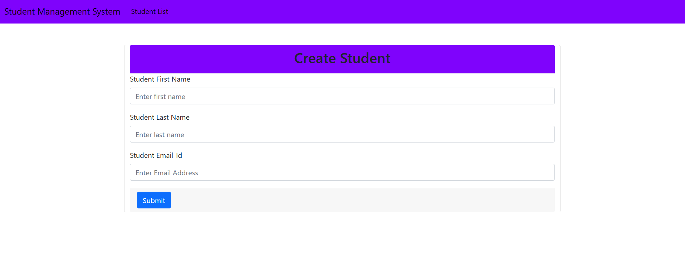
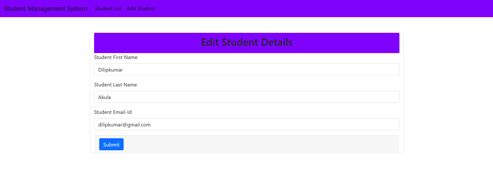
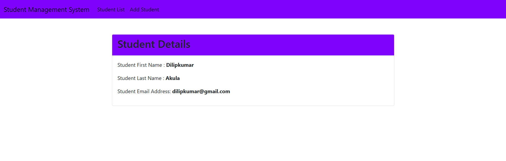

# Student Management System

A full-stack **Student Management System** built with **Spring Boot**,
**Spring MVC**, **Spring Data JPA**, **Hibernate**, **Thymeleaf**,
**MySQL**, and **Bootstrap 5**.

## Features

-   Add Student
-   View All Students
-   Edit Student Details
-   Delete Student
-   View Student Details
-   Form Validation
-   Responsive UI with Bootstrap
-   MySQL Database Integration

## Tech Stack

-   Java 26
-   Spring Boot 4.1.0
-   Spring MVC
-   Spring Data JPA (Hibernate)
-   Thymeleaf
-   MySQL
-   Maven
-   Bootstrap 5

## Project Structure

``` text
src
├── controller
├── service
├── repository
├── entity
├── dto
├── mapper
├── resources
│   ├── templates
│   └── application.properties
└── StudentManagmentSystemApplication.java
```

## Screenshots

> After uploading this repository to GitHub, create an `images/` folder
> in the repository and upload your screenshots with these names.

### Student List


### Add Student



### Edit Student



### Student Details



## Clone

``` bash
git clone https://github.com/<your-username>/student-management-system.git
cd student-management-system
```

## Configure Database

Update `src/main/resources/application.properties`

``` properties
spring.datasource.url=jdbc:mysql://localhost:3306/sms
spring.datasource.username=root
spring.datasource.password=YOUR_PASSWORD

spring.jpa.hibernate.ddl-auto=update
```

Create the database:

``` sql
CREATE DATABASE sms;
```

## Run

``` bash
mvn spring-boot:run
```

Visit:

    http://localhost:8080/students

## Future Improvements

-   Spring Security & Login
-   JWT Authentication
-   Pagination & Sorting
-   Search & Filter
-   Docker Support
-   REST API + Angular Frontend

## Author

**Dilipkumar Akula**
